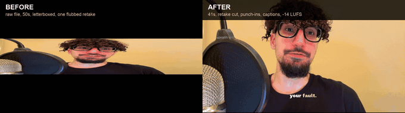

# Verified talking-head auto-editor

Point it at a raw camera file. It removes silence, deletes the takes you flubbed and re-read, cuts your coughs, adds punch-ins, pulls topical b-roll, animates diagrams for the frameworks you teach, burns word-synced captions, normalizes loudness, and hands you a finished file.

Then it re-watches its own work and refuses to deliver the video if it broke anything. That second part is the reason this project exists.

```bash
make edit VIDEO=~/Movies/lesson1.mov SCRIPT=lesson1.txt
```

```
phase 1.6  CFR normalize -> 30fps grid + AV offset (audio +100ms)
phase 2    word-guarded cut removed 18 pause(s), kept 92%, all 622 words preserved
           retake cut: [73.3-75.7]  7-word repeat, keeping the later take
           retake cut: [141.9-155.2] 3-word repeat plus self-correction aside
           false-start cut: [220.0-223.7] 2-word prefix repeat
           head-noise cut: [0.00-0.35] opening cough
phase 4p   EDL via deepseek: 9 punch-ins, 10 b-roll, 9 graphics
phase 7    QA gate
           sync probe @31.9s: offset=0.0ms OK      (x5)
           word integrity: 616/619 words in master (99.5%) PASS
           script integrity: 27 delivered, 1 skipped by choice, 0 DAMAGED
QA: PASS
```

## See it run



Left is the raw camera file, letterboxed, 50 seconds, containing a line the speaker flubbed and immediately said again. Right is what came back: 41 seconds, the flubbed take gone, black bars cropped, punch-ins and word-synced captions applied, loudness normalized.

That is a real run of this repo, not a mockup. The [v1.0.0 release](https://github.com/CEOmarabha/talking-head-autoeditor/releases/tag/v1.0.0) has the full clip with audio, and the terminal log from the same run is in [docs/DEMO.md](docs/DEMO.md).


## Why it works this way

Automatic editors are easy to build and easy to trust wrongly. The failure mode is not a crash. It is a video that looks fine, runs the right length, and quietly has your words missing from it.

This one was built by shipping exactly that, repeatedly, and then engineering it out. Three of those failures now have permanent detectors:

A run once deleted 152 of 623 words mid-sentence. "Assigning status for around five hundred million years" came out as "around Philly." The cutter was classifying speech by loudness, and soft word-endings fell under the threshold. Duration retained was 55 percent, which cleared the guardrail on a technicality. Cutting is now driven by the transcript instead of the waveform, so silence can only be removed between padded word spans.

A second detector deleted the phrase "Superiority, Autonomy," from the sentence that introduces the whole framework. It cut spans where the speech model's confidence dropped below 40 percent, on the theory that low confidence meant a flub. The model was simply unsure of an unusual word. The delivery was perfect. Words that appear in the script are now shielded from that detector.

A third bug left a 21-second dead tail after the speech ended, because a stale duration value meant the caption layer was built to the pre-cut length. Duration is recomputed after every cut now, and the sync probe that landed in that tail is what caught it.

The pattern connecting all three: every signal the editor trusts is a proxy, and proxies lie. Loudness stands in for speech. Model confidence stands in for clarity. Duration stands in for content. So the architecture stopped relying on proxies alone and started checking the finished artifact against what should be in it.

## The three gates

After rendering, the pipeline re-analyses its own output file. Two of these gates can stop delivery outright.

### Lip-sync verification

Five probe points spread across the finished master, each shifted so it lands outside every punch-in, b-roll and graphic window recorded in the EDL, since the speaker's face is not on screen during those. At each point it compares the master against the pre-overlay cut in both streams: image match on the frame band below the captions, and normalized cross-correlation on the audio.

Timeline drift accumulates monotonically, so alignment at spread points proves the whole timeline. Fails if any probe drifts more than 25ms.

This check has one blind spot, and covering it matters more than the check itself. It compares the master against the cut, and both inherit any offset baked into the source recording, so it passes happily on footage whose lips never matched. The pipeline therefore measures the source offset on every render, trusting the result only when three disjoint slices of the window agree, and saying so in the log when they do not.

### Word integrity

Re-transcribes the delivered master and sequence-aligns it against the transcript from the cut stage. This catches damage introduced after cutting, by compositing or re-encoding or a bad filter graph. Fails when more than 3 percent of words vanished along the way.

### Script integrity

The interesting one. It word-aligns the delivered speech against the script that was read, scores every script sentence, and hands each ambiguous one to a model that classifies it.

Paraphrasing is fine. Skipping a sentence is fine. Adding your own elaboration is fine. The only failure is speech the editor destroyed: chopped mid-thought, a concrete fact replaced by nonsense, a sentence that ends in garble.

That distinction is the hard part, and it is why a model does the judging instead of a similarity threshold. Both of these differ from the script, and only one is a problem:

```
FINE      script: "Superiority is not a comparison you win. It is a fact you carry."
          heard : "superiority isn't something you win against people, you just carry it"

DAMAGED   script: "it has been assigning status for around five hundred million years"
          heard : "it's been a signing status for around Philly"
```

The gate also cross-references its own splice ledger. A sentence can only be ruled damaged if a cut actually landed inside it. Without that check it would block videos over words the speech model merely misheard, which happened before the ledger existed.

Real output from a blocked render:

```
script integrity: 26 delivered, 1 skipped by choice, 8 reviewed -> 1 DAMAGED
  script: 'There are three signals your Lizard Brain broadcasts... Superiority, Autonomy, and Certainty.'
  heard : '...reads in every single human interaction and certainty. S -A'
  why   : lost Superiority and Autonomy, only one of three named
delivery: RuntimeError: script damage, video delivery blocked
```

Full detail in [docs/VERIFICATION.md](docs/VERIFICATION.md).

## What it does to your footage

Four cutting detectors run in sequence. All of them work from the transcript, so a cut can never land inside a word.

`word_guarded_cut` removes silence between words, padded on both sides. `detect_retakes` finds lines you said twice, keeps the last read, and swallows the self-correction you muttered in between ("let me say that again"). It checks your script first, since a phrase that repeats there is deliberate writing rather than a flub. `detect_false_starts` catches restarts that change the ending, like "You never hesitate" becoming "You never compromise," where the repeat is too short for the run matcher to see. `detect_head_noise_audio` removes the cough on the opening frame, which speech models transcribe as a low-confidence word and ordinary cough detectors therefore miss.

One model call then authors the edit decision list: punch-ins on emphasis, b-roll queries matched to what is being said, animated diagrams for frameworks and lists, stat cards for numbers. A deterministic heuristic produces the same shape when no model is configured, so nothing blocks on an API.

Finishing is karaoke captions where each word lights up as it is spoken, sparse sound design, two-pass loudness to -14 LUFS, aspect-correct export, and a SHA-256 hash-lock with a QA receipt.

Every phase is explained in [docs/PIPELINE.md](docs/PIPELINE.md).

## Install

macOS or Linux, Python 3.10 or newer, about 2GB of disk for models and cache.

```bash
git clone https://github.com/CEOmarabha/talking-head-autoeditor.git
cd talking-head-autoeditor
make install
```

That checks for ffmpeg and installs it if missing, builds a virtualenv, installs four Python packages, downloads the speech model, and sets up the Remotion diagram renderer if you have Node.

```bash
cp .env.example .env      # add your keys, all of them optional
make check                # confirm everything resolves
```

### What each key buys you

| Key | Cost | Without it |
|---|---|---|
| `DEEPSEEK_API_KEY` | about 1 cent per video | Heuristic edit decisions, no semantic script gate |
| `PEXELS_API_KEY` | free | No stock b-roll, diagrams still render |
| `PIXABAY_API_KEY` | free | One fewer b-roll source |
| `ELEVENLABS_API_KEY` | optional | Synthesized sound-effect kit instead |
| `TELEGRAM_BOT_TOKEN` | free | No push to your phone, files land on disk |

DeepSeek V4 Flash alone runs the entire creative layer. Transcription, cutting, compositing, captions and diagrams are all local and free. The model is called twice per video: once to author the edit, once to judge script integrity.

## Use it

```bash
# once, ever: measure your camera rig's audio offset
make calibrate VIDEO=~/Movies/any-take.mov

# then edit
make edit VIDEO=~/Movies/lesson1.mov SCRIPT=lesson1.txt

# vertical pacing for short-form
make edit VIDEO=~/Movies/clip.mov STYLE=short ASPECT=9x16
```

`SCRIPT` is optional and worth supplying. It powers caption correction, which fixes misheard words while leaving your deliberate paraphrases alone, and it feeds the semantic gate.

You get back the master, an SRT sidecar, `EDL.json` with every creative decision and its timing, `QA_REPORT.json` with the gate results and hash-lock, and `SCRIPT_INTEGRITY.json` with the sentence-by-sentence verdicts.

A 4-minute video takes 20 to 35 minutes on Apple Silicon. It is CPU-bound, and transcription and compositing dominate.

## Make it yours

Colours, font, caption density, how aggressively it cuts, and the gate thresholds all live in [brand.yaml](brand.yaml). You never edit Python to change a look.

The creative instincts live as director principles in `autoeditor/premium.py`. They are prose inside the prompt, covering what earns a punch-in, when a diagram beats stock footage, and how sparse the sound design should be. Rewrite them in your own voice.

## Ideas worth stealing

Verify against the artifact rather than the plan. Re-analysing the rendered file catches a class of bug that inspecting intermediate state never will.

Let the judge see both texts. Asking a model whether something is damaged, with the script and the delivery side by side, beats any similarity threshold, because it separates intent from accident.

Fail loudly in the log. A swallowed NameError silently disabled every large-file delivery here for days, and the only symptom was that videos never arrived.

Parse model JSON by scanning for balanced braces. A greedy regex swallows trailing prose and throws, which quietly degrades whatever depended on it.

Retry the model call. One dropped request collapsed 12 b-roll clips down to 1, and the video just looked a bit plain.

## License

MIT, see [LICENSE](LICENSE). Use it commercially, fork it, sell what you make with it.

Built by [Omar](https://github.com/CEOmarabha).
